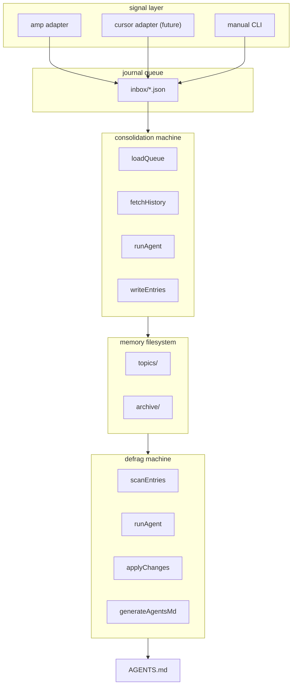

# AGENTS.md

## voice

lowercase, terse, no sycophancy. ALL CAPS for emphasis only.

## tech stack

- **runtime**: bun
- **state machines**: xstate v5
- **schema validation**: arktype v2
- **error handling**: neverthrow (ResultAsync, tagged union errors)
- **formatting**: oxfmt
- **linting**: oxlint

## architecture



## key patterns

- **inject at boundary**: xstate machines use `machine.provide()` for adapters, no direct I/O
- **stable IDs**: `id__XXXXXX` format, 6-char base58 hash
- **usage tracking**: `used` counter + `last_used` timestamp auto-increment on read
- **atomic writes**: write to `.tmp`, rename into place

## commands

```bash
bun run typecheck  # type check
bun run test       # run tests
bun run lint       # oxlint
```

## file naming

memory entries: `descriptive-title -- topic__x topic__y id__XXXXXX.md`

## cross-links

use `[[id__XXXXXX]]` syntax, resolved via grep.
